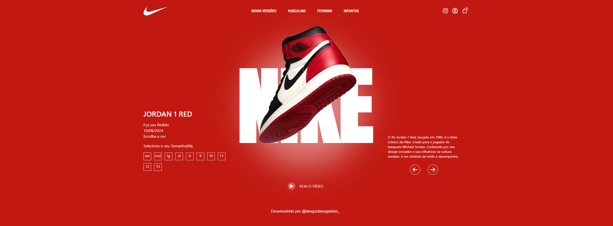
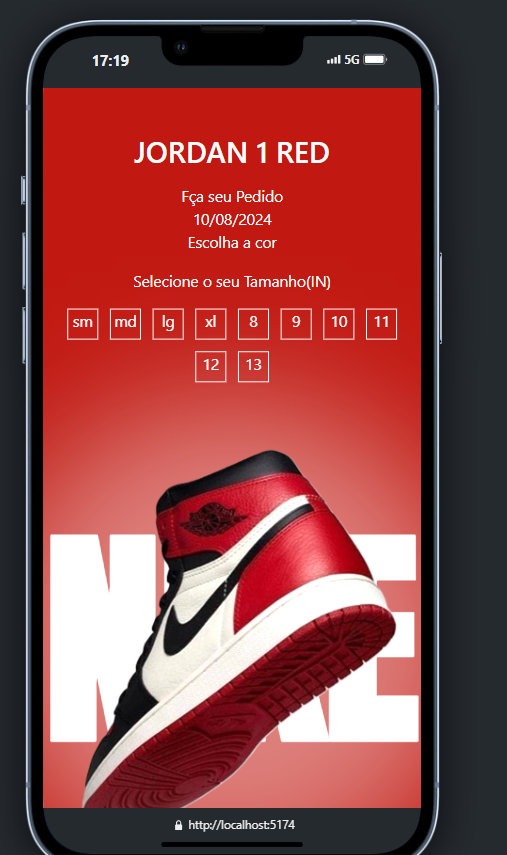

<a href="">Clique aqui para ter acesso a esse layout!!</a>

# Layout Web Air Jordan red 1

Este projeto foi desenvolvido com as tecnologias REACT | Tailwindcss e Framer Motion, utilizei o REACT para separação dos componentes Navbar e Hero da minha aplicação, no CSS utilizei o Tailwind, 
com esta tecnologia consigo estilizar o layout de forma rápida e eficiente, excelente para agilizar projetos grandes!! 
Utilizei o framer-motion para dar um encanto no UI/UX design do projeto, onde boto animações de left e Up, onde faço o layout ficar mais animado e agradável para o usuário que acessar este site.

Este layout também está responsivo para telas menores e dispositivos móveis.

# ING

In this project, I used REACT, Tailwind, and Framer Motion technologies to separate components such as the Navbar and Hero in my application. With Tailwind, I can apply styles quickly and efficiently, making it excellent for large projects!

This layout is responsive for small desktops and mobile devices.
